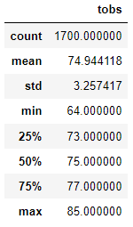
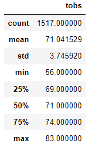

### Advanced Data Storage and Retrieval

## Overview
The purpose of this assignment was to review weather data and determine if an investor should move forward financing a surf shop.  We utilized Posgres along with Python to complete the assignment.  Based on the below results, the investor should move forward financing the deal. 

## Results
- **June Summary Statitics**

- **December Summary Statitics**

## Summary
Based on this analysis, we should move forward with opening the shop in hawaii for the following reasons:
1. **There is only a 3 degree tempurature differential from June to December**
    - This indicates the weather will be roughly the same throughout the year
2. **Both months have tempurature ranges between on average of 60 degrees to the low 80s.**
    - This appears to be vary promising weather for a surfshop since even December experiences warm weather.
